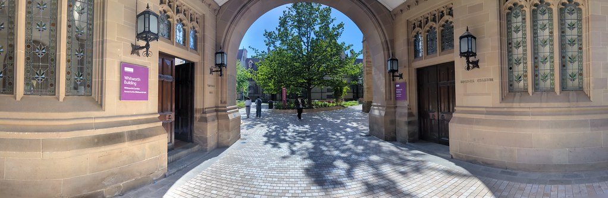

# Introduction to Industrial Experience {#intro}

Studying engineering at the University of Manchester helps you to to gain technical skills and knowlege during their lectures, laboratories and projects. With this knowledge you will be able to solve problems, develop new ideas, and design innovative solutions to solve a wide range of engineering and social problems. A year of **Industrial Experience (IE)** will consolidate, broaden and deepen what you are taught at University while preparing you for your final year of study back at University.

```{r intro-fig, echo = FALSE, fig.align = "center", fig.cap = "(ref:captionexperience)", out.width = "100%"}

```

(ref:captionexperience) Industrial Experience (IE) is an entrance way to new opportunities provided by your employer to develop your skills and knowledge. Panoramic picture of entrances and the Queen's Arch of the [Whitworth Building](https://en.wikipedia.org/wiki/Whitworth_Building) at the University of Manchester


## The value of IE for you {#value}
You will gain valuable experience and can further explore your career interests while you are on Industrial Experience. [@experiencing;@ucas;@penney] The “with Industrial Experience” (IE) scheme of our undergraduate degrees provides a valuable opportunity for you to experience employment before you graduate. There are many advantages to this, including:

* The experience of industrially focused engineering and applying it to real-world scenarios
* The responsibilities associated with commercial employment
* Working within a team, collaborating with the wider organisation that you have joined
* The satisfaction of contributing to products and serfvices that will influence the future development of society
* The consolidation of your education to date
* The increased likelihood of return (or extended) job offers after graduation. It is common for students who perform well to receive return offers from their placement providers
*  For many, Industrial Experience is the start of a transformation from student to engineer and from student to professional

## The value of IE for your employer {#evalue}

There are many advantages for employers who host students on placement: 

* The opportunity to have a year-long “interviews” with undergraduate students who have two years (or more) experience at university.
* The ability to familiarise students with working practices leading to fast-track interviewing and graduate training as a prospective future employee.
* Access to high quality students as industrial trainees who can offer the employer valuable resources and fresh insights
* Employers with a long-term commitment to the placement of students will have access to potential recruits by maintaining contact with the University through the student

## The value of IE to the University {#uvalue}

The are many advantages to the University of you doing a placement year 

* The Unversity produces better graduates because you will develop skills and gain knowledge that are difficult to teach and learn in a traditional academic environment
* Graduates from the University with placements get paid more, get better jobs and progress more quickly in their chosen careers. We know this from many different sources such as the annual [graduateoutcomes.ac.uk](https://www.graduateoutcomes.ac.uk/) survey [@graduateoutcomes]
* Students returning from placements tend to do much better final year (honours) projects and perform better in exams and coursework 

## Industrial Experience: Win-win-win? {#win}

So Industrial Experience placements can be a _win-win-win_ situation for all three parties involved:

* they are a win for your employer, for the reasons outlined in section \@ref(evalue)
* they are a win for the University, for the reasons outlined in section \@ref(uvalue)
* they are a win for _you_, for the reasons outlined in section \@ref(value)

So, we hope that you enjoy and make the most of your Industrial Experience placement year in industry.  The rest of this guide helps you to do just that. We wish you the best of luck on your journey and look forward to hearing how you get progress.

```{r winwinwin-fig, echo = FALSE, fig.align = "center", fig.cap = "(ref:captionwinwinwin)", out.width = "100%"}

```

(ref:captionwinwinwin) Industrial Experience can be a win-win-win situation for all three parties involved: you, your employer _and_ your University.  [Creative Commons BY](https://creativecommons.org/licenses/by/2.0/deed.en) image of the UEFA Champions League Trophy by David Flores on Wikimedia Commons [w.wiki/6Ubh](https://w.wiki/6Ubh)


