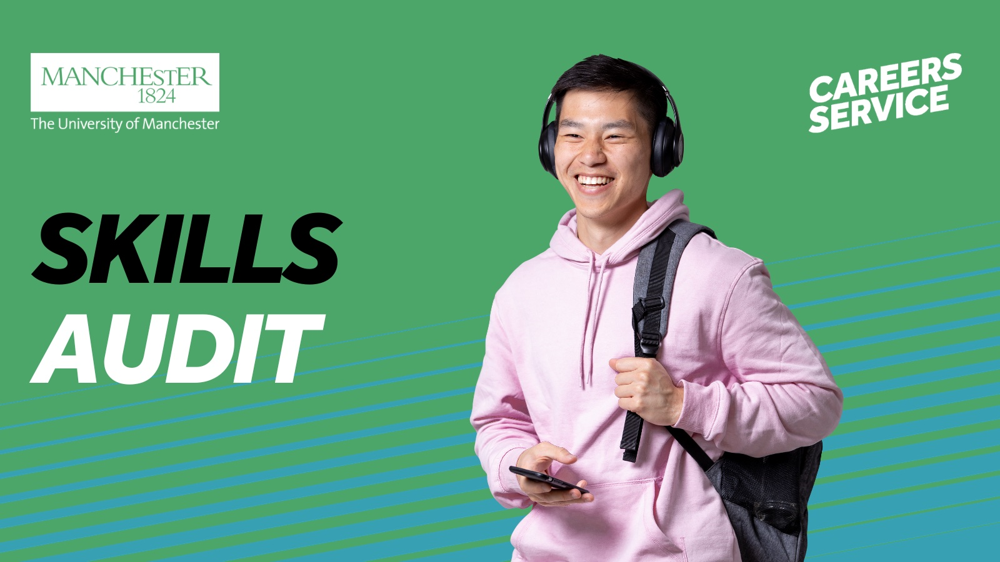

# Aims of Industrial Experience {#aims}

The Intended Learning Outcomes (ILOs) for the placement year are

* To learn how to operate in a professional environment
* To apply the skills and knowledge you've learned at University in the workplace as directed by your employer
* To grow as a professional by seeking out development opportunities to acquire new skills and knowledge in the workplace
*  To meet (or exceed) the expectations of your employer, as set out in your contract of employment
* To describe your development as a professional in a short written report and (optionally) to share that with other students on your course

Some of this will involve developing softer skills, digital skills and knowledge beyond your University curriculum, some of which are described below. The assessment of the ILOs above is described in chapter \@ref(assessment).

## Developing your professional skills {#soft}
Most engineering education tends to focus on technical skills and knowledge.  While these are important, they are not everything that you'll need to succeeed as a professional. 

```{r skillsaudit-fig, echo = FALSE, fig.align = "center", out.width = "100%", fig.cap = "(ref:captionskillsaudit)"}

```

(ref:captionskillsaudit) Completing a skills audit will help you develop your self-awareness and better articulate what you have to offer to prospective employers, find out more at [www.careers.manchester.ac.uk/options/skills/myskills](https://www.careers.manchester.ac.uk/options/skills/myskills/) [@]

You may have done some group work during your undergraduate study, but most of the assessment at University (and school) is based on your individual performance such as:

* Exam performance: exams try to measure your skills and knowledge as an individual, collaboration (as in plagiarism) is punished
* Coursework submission: most coursework tends to be solo projects, that you do on your own, collaboration (as in plagiarism) is usually punished

The workplace is different. You will probably spend a significant amout of time collaborating with more diverse teams of people than you did at University. This means that professional skills, sometimes called [soft skills](https://en.wikipedia.org/wiki/Soft_skills) [@soft;@transferable;@professionalism], are important such as:

* Teamwork
* Leadership
* Adaptability
* Negotiation
* Communication: reading, writing, speaking and listening

Your placement is an opportunity to develop these professional skills, while also deepening and broadening your technical knowledge.

## Audit your skills {#Audit}
We require students to audit their skills at the beginning and end of their placements. Your employer will probably ask you to do something similar during your regular meetings with your manager. 


## Exploring your digital capabilities {#digital}
Part of becoming a professional means developing your digital capabilities. Digital capabilities enable us to ‘live, learn and work in a digital society.’

The Jisc Discovery tool is a supportive online tool, that can help you understand and develop your digital capabilities. By completing a question set within the tool you can gain a personalised report that includes
links to suggested resources in the tool’s resource bank to support your further development. It is recommended that you repeat the question sets annually, to recognise your progress across the different elements of digital capability. You can access the Discovery tool through 

*  My Learning Essentials: Develop your digital capabilities resource. [education.library.manchester.ac.uk/none-programme-content/digital-capabilities/](https://www.education.library.manchester.ac.uk/none-programme-content/digital-capabilities/)
* My Skills Development – on CareerConnect [www.careers.manchester.ac.uk/options/skills/myskills/](https://www.careers.manchester.ac.uk/options/skills/myskills/) [@audit]

These resources support you in reflecting on your development on your reports - providing an action plan template for you to complete.

For placement students, we recommend taking the:

* ‘Current student’ digital capability question set, which provides an in-depth exploration of your digital confidence and experience.
* ‘Digital skills in AI and generative AI’ question set, which also has its own resource bank

## Recording your development {#development}
From work with employers, we know they value narratives around how you have developed your skills and capabilities through your studies. You can use the language from your Discovery tool reports to update your CV / online professional profile to help you record your digital development. This blog by the Careers Service can further support you with capturing and articulating the capabilities you develop during your placement. [@conway]