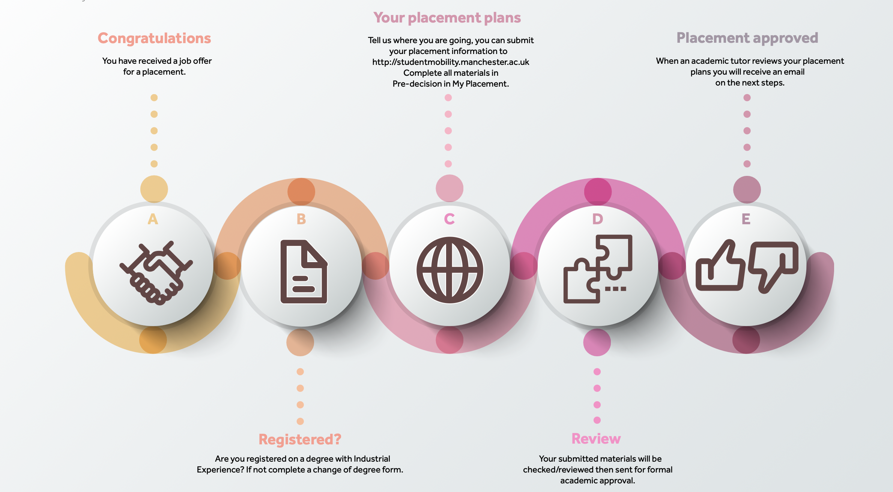

# Requirements for Industrial Experience {#requirements}

There are several requirements for Industrial Experience (IE) described in section \@ref(basic) and illustrated in figure \@ref(fig:plans-fig)

```{r reqs-fig, echo = FALSE, fig.align = "center", fig.cap = "(ref:captionreqs)", out.width = "100%"}

```

(ref:captionreqs) A panoramic picture of University Place Manchester


## Basic requirements {#basic}

The basic requirements for Industrial Experience, shown in figure \@ref(fig:plans-fig) are:

1. You should be registered on IE, this may require that you change degree program. Bachelors students can change onto and off IE any point up until the end of your by filling in the [change of degree form](https://studentnet.cs.manchester.ac.uk/ugt/changedegree.php), either in print or pdf and getting it signed-off by the year tutor and employability lead [@changedegree]
1. You have received a job offer and make an application for IE via [My Placement](https://studentmobility.manchester.ac.uk)  at [@myplacement]
1. The University formally approves your placement application before you start work 
1. You formally accept the job offer from the employer and sign a contract of employment

```{r plans-fig, echo = FALSE, fig.align = "center", out.width = "100%", fig.cap = "(ref:captionplans)"}

```
(ref:captionplans) Once you've received a job offer you need to: (1) check you are registered on IE (2) Tell us where you are going (3) Wait for approval and finally (4) Have your placement formally approved against the requirements outlined in section \@ref(basic)


## Finding a placemeent {#finding}

The basic requirements might sound simple but finding a suitable placement requires a significant amount of your time and energy, and you'll have to balance these requirements with those of your study.

1. You will need to prepare and debug your CV, as covered in COMP101 and COMP2CARS, see [Debugging Your Future](https://www.cdyf.me/debugging) [@debugging]
1. You need to find and apply for jobs, see [Finding Your Future](https://www.cdyf.me/finding) [@finding] Your placement needs to be something broadly related to your degree but this can encompass a wide variety of activities from business analysis, software engineering, software testing, hardware design, data science etc. You can self-arrange a placement but it needs to be approved before you can go on placement.
1. You will need to attend any job interviews, assessment centres etc on-line or in person, sometimes multiple rounds, that you apply to
1. If you are made job offer that you'd like to accept you need tell us about it, BEFORE you sign any formal contract of employment 

## Grade requirements 
There are no minimum grade requirements besides passing the first and second year of your degree. Ideally you will pass first time, but its OK to pass with resits, see section \@ref(resits). Your placement year doesn’t count towards your degree classification, but it **does** appear in the title of your degree e.g.

* `BSc (Hons) Computer Science with Industrial Experience`

Instead of:

* `BSc (Hons) Computer Science`: the “vanilla” degree

Your placement year is also assessed, as described in chapter \@ref(assessment).

## Visa requirements 

You MUST **CHECK** your visa. If you’re not a UK student and have a Student visa, you will need to extend your visa an extra year to include your placement year if you’re not already registered on IE. See 

*  Student Visas: Changing your Course [@changing] 
*  Student immigration and visas [@immigration]


## Your right to work in the UK {#uk}
If you are not a UK resident, a placement year gives you the right to work **full time** in the UK because it is an assessed part of your undergraduate study. [@righttowork;@workingduringstudy] This applies to: 

* Students from the UK and EU
* Students from *outside* the UK and EU (e.g. Tier 4 visa holders)

This means you don’t need to apply for a work permit, as your Tier 4 visa entitles you to work when it is an integral part of your degree.

During term-time, student visa holders are allowed to work up to 20 hours per week *during term time* and *full-time during vacation periods* according to the [University’s vacation dates](https://www.manchester.ac.uk/discover/key-dates) [@keydates], including Christmas, Easter and Summer. See [Student Visas: Working during your Studies](https://www.studentsupport.manchester.ac.uk/immigration-and-visas/working/working-during-your-studies/) [@workingduringstudy]


## Working outside the UK

It is possible to do a placement year outside the uk, these are described in the next part, chapter \@ref(notuk).


