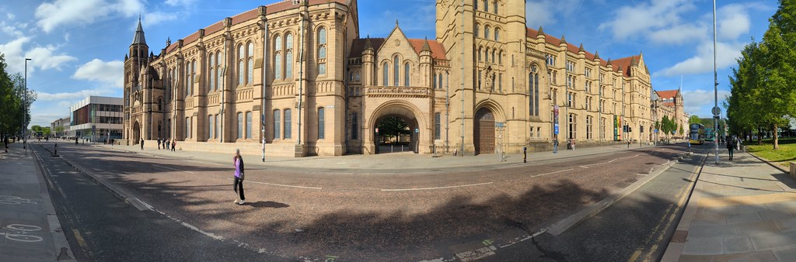

# Industrial Experience outside the UK {#notuk}

Some degrees at the University of Manchester incorporate a period of study or work outside the University. [@studyabroad]

```{r rothwell-fig, echo = FALSE, fig.align = "center",  fig.cap='(ref:captionrothwell)'}

```

(ref:captionrothwell) A panoramic picture of the Queen's Arch and the [Whitworth Building](https://en.wikipedia.org/wiki/Whitworth_Building) in Manchester. While many studnets work in Manchester, and most stay in the UK, it is possible to work outside the UK provided certain conditions are met, outlined in this chapter.

## Study Abroad {#abroad}
Study Abroad is **not** currently an option for Computer Science degrees at the University of Manchester, however, you can _work abroad_ (outside the UK) for your placement year. While most students do their placements in the UK,  it is possible to do placements outside the UK as well provided you can find a suitable employer and can get (or have) the right to work in the that country.


In Computer Science for example, many students have done placement years at CERN in Switzerland. [@cern]

To work outside the UK, **YOU** (and your employer) will need to sort out an appropriate visa that allows you to work in that country. For example, working the USA requires a J-1 visa - you’d need to find a sponsor. There is more information from the careers service at on working outside the UK at:

* [GoinGlobal](https://www.careers.manchester.ac.uk/international/goinglobal/) [@goinglobal]
* [Finding international jobs. Information for students looking for opportunities outside the UK](https://www.careers.manchester.ac.uk/international/internationaljobs/) [@interjobs]

The University requires that the employer meets certain requirements before we approve year-long placements. Approval for summer internships is only required if they are part of the integrated masters (MEng) programme, speak to the MEng tutor.

In some cases you can apply for funding from third parties such as the Turing Scheme which provides funding that was previously available through the Erasmus Programme of the European Union. [@turing]

## Applying for a placement outside the UK {#outside}

Students taking a placement outside the UK should apply to the University using MyPlacement in the usual way as described in section \@ref(basic).

See also [Fees & funding](https://www.manchester.ac.uk/study/undergraduate/fees-and-funding/) and [Student visa holders](https://www.studentsupport.manchester.ac.uk/immigration-and-visas/)

```{r notuk-fig, echo = FALSE, fig.align = "center",  fig.cap='(ref:captionnotuk)'}

```

(ref:captionnotuk) You can do your Industrial Experience year outside the UK provided you have the right to work in that country or an employer is willing to sponsor the appropriate work visa for you. Either way, the University also needs to formally approve the placement. Creative Commons [BY SA](https://creativecommons.org/licenses/by-sa/4.0/deed.en) licensed map of Europe by Rob984 via Wikimedia Commons [w.wiki/3FXK](https://w.wiki/3FXK)
