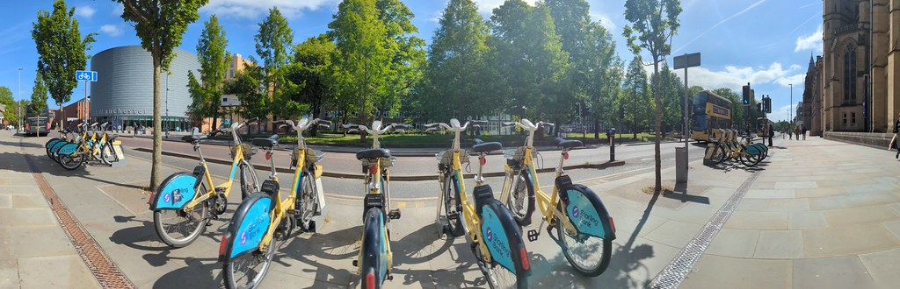

# So, You're Going on Industrial Experience? {#starting}
Congratulations, if you’ve accepted a job offer and its been approved, you’re ready to start your Industrial Experience placement. 

```{r onyerbike-fig, echo = FALSE, fig.align = "center", fig.cap = "(ref:captiononyerbike)", out.width = "100%"}

```

(ref:captiononyerbike) So, you got “[on your bike](https://en.wiktionary.org/wiki/on_your_bike)” [@tebbit] and you are going away on a new adventure? Now your job is to ride that metaphorical bike somewhere interesting with the help of your new colleagues. Panoramic picture Starling Bank Bikes, available for hire from [beeactive.tfgm.com/cycle-hire](https://beeactive.tfgm.com/cycle-hire/)


## Congratulations! {#congrats}
You've done very well to find a placement during a year when graduate application ratios hit a record high of `140:1`. This means that in 2014 the average _graduate_ vacancy had 140 applicants, with similar ratios for placement year applicants. [@ratio]  This confirms what you've probably already found out in your job hunting. It is an incredibly tough job market for _everyone_ at the moment and that includes students seeking employment through:

* summer internships
* year-long Industrial Experience placements
* graduate vacancies 

So, you've done incredibly well to find a placement in a very competitve job market. Give yourself a pat on the back!

## Dive, Survive or Thrive? {#thrive}
Crudely speaking there are three scenarios for your placement year shown in figure \@ref(fig:survival-fig), they are:

1. Dive - you **won't meet** the expectations of your employer
1. Survive - you **will meet** the expectations of your employer
1. Thrive - you will **exceed** the expectaons of your employer

Most students **meet** or **exceed** the expectations of their employers. We want to help you achieve this while avoiding the first scenario and pointing you to help and advice if you think you might be starting to (or you actually are) struggling on placement. 

## Key placement dates for IE {#keydates} 

There are seven key dates you need to pay attention to before, during and after your placement: 

1. Placement approval, see section \@ref(approval) 
1. First check-in, see section \@ref(one)
1. Second check-in, (outside UK only) see section \@ref(two)
1. Three way progress meeting, see section \@ref(three)
1. Project selection, see section \@ref(four)
1. Report submission, see section \@ref(five)
1. Industrial Experience panel for incoming year 2 students, see section \@ref(six)


### Placement approval {#approval}

Obtain and submit plans for formal academic approval of your placement, deadline **31 August 2025**, see section \@ref(basic)


### First check-in meeting {#one}

Initial one-to-one check-in meeting, **30 September – 31 October 2025**. Students should coordinate with allocated academic to arrange a suitable time and date.

### Second check-in meeting {#two}

For students on placement outside the UK (only) **20-31 January 2026** Students should coordinate with allocated academic to arrange a suitable time and date.

### Manager, Tutor and You meeting {#three}

 Academic tutor, personal tutor and stuent meeting,  **31 March – 25 April 2026**. Students should coordinate with academic, supervisor/line manager to arrange a suitable time and date. If you are not able to arrange a date during this time period, the meeting needs to take place before the end of your placement year


### Honours Project selection {#four}

The `(Hons)` in your `BSc (Hons) Computer Science with Industrial Experience` comes from your **Honours Project**, aka 3rd year (of final year) project. In April/May of your placement year you'll need to either: 

* Pick a project proposed by an academic from the honours project book 

**OR** 

* Propose your own project and find an academic who will agree to supervise it

You'll get an email from [Terence Morley](https://research.manchester.ac.uk/en/persons/terence.morley), make your project selections or propose an own project early **April/May 2026**.


### Placement report submission {#five}

For Bachelors students, your placement report is due at the **end of welcome week 2026**, submit placement report using the form described in section \@ref(bsc) which documents some of the reflection you did with your personal tutor outlined in chapter \@ref(tutors).


### Industrial Experience panel {#six}
If you'd like to serve on a IE panel during welcome week lecture for next years incoming year 2 students, we invite a selection of students who've been on placements to describe their year in industry to students in a _welcome back to year 2_ lecture at the beginning of term. There is a check box on the placement submission form that allows you to indicate if you'd like to serve on this panel.


<!--## Skills audit -->


<!--## Don't forget to read your email {#email} -->

## Resitting exams while on Industrial Experience placement {#resits} 

If you fail any of your second year exams, you may need to resit them. This doesn't prevent you from doing your placement, but you will need to negotiate some time off to resit any exams and these will need to be done in person in Manchester. [@resits]

## Mitigating Circumstances {#mitcircs}

Mitigating Circumstances is a policy and procedure in place whereby if students experience personal circumstances that affect their ability to perform to the best of their ability across exams, assessments, or their attendance to teaching activities (such as labs or workshops) they can apply for Mitigating Circumstances or Coursework Extension. [@mitcircs]

## Don't forget to read your University email! {#email} 
Your employer will expect you to read your work email on a regular basis, we also expect you to read your University email `@student.manchester.ac.uk` too as it is our primary form of communication with you on your Industrial Experience placement.

For example, your personal tutor and the placement year tutor will be sending you important information by email, so please make sure you read it regularly, we recommned somewhere between at least once a day and once a week.


## Paying your taxes {#taxes}

Moving from student to professional means you'll be paid a salary. Yay! Unfortunately this also means you'll have to start paying taxes too. Taxes are one of only two things we can be sure of in life:

1. Death [@death]
1. Taxes [@death]

In the UK the relevant taxes are:

* **Income Tax**: is taken out of your salary before you receive it, see [gov.uk/income-tax](https://www.gov.uk/income-tax) [@income-tax]
* **National Insurance**: see [gov.uk/national-insurance](https://www.gov.uk/national-insurance) [@national] and applying for a National Insurance [gov.uk/apply-national-insurance-number](https://www.gov.uk/apply-national-insurance-number) [@apply]
* **Council Tax**: you will need to apply for a council tax exemption see [gov.uk/council-tax](https://www.gov.uk/council-tax)[@council-tax]. If you're moving to a new location (e.g. away from Manchester) to where you were living as a student, [@exemption1;@exemption2]


## You are an Ambassador {#ambassador}
One of the reasons we have the biggest elective program of Industrial Experience (IE) at the University of Manchester is that students like you have gone on placements before you and set a good reputation with their employers. Employers come back recruiting more students and frequently make return offers of employment after graduation.

```{r ambassador-fig, echo = FALSE, fig.align = "center", out.width = "80%", fig.cap = "(ref:captionambassador)"}

```
(ref:captionambassador) You are an employee **and** you are also an ambassador for the Department of Computer Science, the University of Manchester and its students too. Public domain image adapted from _Hello my name is …_ sticker by Eviatar Bach on Wikimedia Commons [w.wiki/32RV](https://w.wiki/32RV)

While on placement you are an ambassador, see figure \@ref(fig:ambassador-fig). You are an ambassador for: 

1. The Department of Computer Science 
1. The University of Manchester
1. Your fellow and future students

 We hope that you can continue to uphold the good reputation of our department and its students while you are on placement so that employers keep coming back to recruit more students like you in the future. 


## Starting Your Future {#etc}
This chapter has described some basic information to help you get started on a placement year at the University of Manchester, for a broader discussion of how to prepare yourself for the workplace, see _Starting Your Future_ at [cdyf.me/starting](https://www.cdyf.me/starting). [@starting]

```{r survival-fig, echo = FALSE, fig.align = "center", out.width = "100%", fig.cap = "(ref:captionsurvival)"}
knitr::include_graphics("images/DiveThriveSurvive.png")
```
(ref:captionsurvival) How can you survive and thrive on your placement year? Jungle survival sketch by [Visual Thinkery](https://visualthinkery.com) is licensed under [CC-BY-ND](https://creativecommons.org/licenses/by-nd/4.0/)

