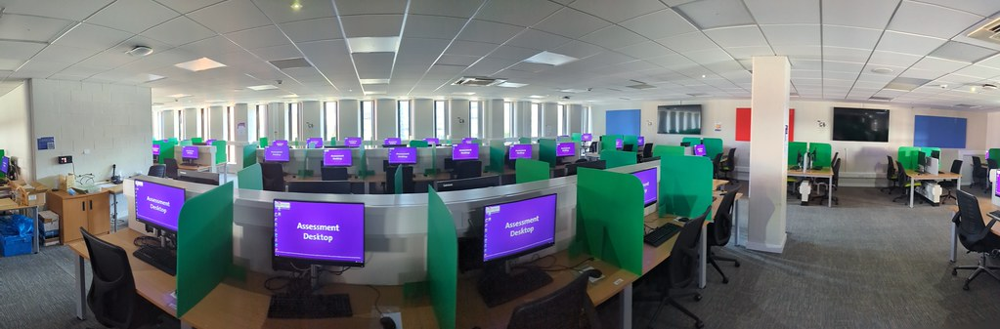

# Assessment of your Industrial Experience year {#assessment}

Your placement is formatively assessed by visits during your placement and a short report you write at the end of the year.  The title “with industrial experience” appears in the title of your degree and your degree certicate.

```{r assessment-fig, echo = FALSE, fig.align = "center", fig.cap = "(ref:captionassessment)", out.width = "100%"}

```

(ref:captionassessment) Your placement year is an assessed part of your undergraduate degree, but you won't have to sit any traditional univesity exams. Your tutor and the placement team will be assessing your progress on placement as outlined in this chapter. Your performance will also be “examined” and judged by your employer, though not all will give you a grade or classification for this. Panoramic picture of Assessment Desktops during exam season at the University of Manchester.

## Bachelors degrees: BSc {#bsc}

At the end of the year, we ask you to complete a short report using this Microsoft form (UoM login required) [bit.ly/placement-report-form](https://bit.ly/placement-report-form)

As part of that we ask you to complete a skills audit at the beginning and end of the year and compare the results, see [My Skills Development – on CareerConnect](https://www.careers.manchester.ac.uk/options/skills/myskills
) [@audit]

## Integrated Masters degrees: MEng {#meng}


If you are on the Master of Engineering (MEng) programme, the IE processes are mostly the same as for the BSc programme. The differences are:

* The IE year is taken after year three, not year two 
* To stay on the MEng programme you must have a year end average of at least 60% in years one and two. If you don’t, you’ll be transferred to the equivalent bachelor’s programme. If your year three average is below 60% you will graduate.
*  The Meng students who don’t do an IE year will do a short (9 – 12 week) placement over the summer between years three and four.
* The placement is assessed in COMP40901 by a report you submit at the end of September and a seminar you give during Reading Week. This unit is worth 25 credits of the final year.

Speak to the MEng tutor to find out more