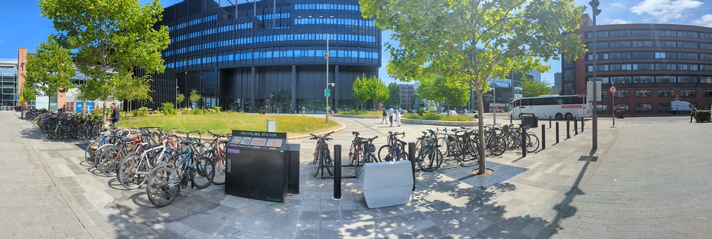

# Welcome to Industrial Experience (IE) {-}

Welcome to the Industrial Experience (IE) placement handbook. This book is primarily for undergraduate students studying Computer Science in the School of Engineering at the University of Manchester. The handbook has been written to help you (and your personal tutor) before, during and after your year-long placement in industry.

```{r engineering-fig, echo = FALSE, fig.align = "center", fig.cap = "(ref:captionengineering)", out.width = "100%"}

```

(ref:captionengineering) A panoramic picture of the [Nancy Rothwell Building](https://en.wikipedia.org/wiki/Nancy_Rothwell_Building), home to the School of Engineering at the University of Manchester


## The Placements Team in Computer Science {#team}

The placements team are here to provide support for your Industrial Experience alongside the support you get from your employer. The team consists of:

1. **Duncan Hull**: Employability lead, Computer Science [manchester.ac.uk/staff/duncan.hull/contact](https://personalpages.manchester.ac.uk/staff/duncan.hull/contact), see figure \@ref(fig:team-fig)
1. **David Petrescu**: Placement year tutor for Industrial Experience in Computer Science [manchester.ac.uk/en/persons/david-petrescu](https://research.manchester.ac.uk/en/persons/david-petrescu),  see figure \@ref(fig:team-fig)
1. **Your personal tutor**: in _most_ cases this will be the same personal tutor you had in first year. If you are not sure who your personal tutor is, get in touch with the second year tutor listed in undergraduate handbook [@ughandbook] and the [Monday Mail](https://studentnet.cs.manchester.ac.uk/ugt/mondaymail/) [@mondaymail] 
1. **The placements admin team**: A group of professional services staff providing adminstrative support in the School of Engineering, see section \@ref(contacts)
1. **Your employer**: Principally your line manager(s), colleagues and [Human Resources](https://en.wikipedia.org/wiki/Human_resources) (HR) department, see chapter \@ref(employers)

Some of the placements team above are pictured in figure \@ref(fig:team-fig).


## What is an Industrial Experience placement year? {#placement}

A Industrial Experience (IE) placement is a formal period of paid work that is an assessed part of your study as an undergraduate. [@whatisie] The length of the employment varies with employers. In **this** guide a placement (also known a year-in-industry or sandwich year) is a **full year** of paid employment. Placements take place in the penultimate year of your study, for Bachelors students, that's _after_ your second year of study and _before_ your final year of study.

* a placement is _not_ a summer internship, although these are also good things to do and lots of students do them
* the usual duration of a placement is 12 months, typically starting between June and August, depending on the employer. At the University of Manchester, the minimum length of employment for placements is 9 months, though 12 months is much more common. 


During your placement you are a both full-time student and an employee of an organisation at the same time. 

Placements aren't the _only_ way to get experience before you graduate, but they are one of the most popular. For a discussion advantages and disadvantages of placement years over summer internships see [cdyf.me/experiencing#interns](https://www.cdyf.me/experiencing#interns) [@experiencing]


## Placement year fees for IE {#fees}

You pay reduced tuition fees for your placement year, these are not the full tuition fees you pay while studying at University full time, although for tax purposes you are still a full-time student, see section \@ref(taxes). The fees you pay depend on if you are an international student (or not) see [Study Abroad, Placements and Other fees](https://www.studentsupport.manchester.ac.uk/finances/tuition-fees/fee-amounts/other-fees/) [@fees]


## How this handbook is structured {#guide}
The rest of this placement handbook is structured as follows: 

* Chapter \@ref(intro) outlines the value of a placement for you, your employer and your University 
* Chapter \@ref(aims) describes the aims of your Industrial Experience (IE) year
* Chapter \@ref(requirements) describes the requirements that need to be met for IE
* Chapter \@ref(notuk) discusses placements outside the UK
* Chapter \@ref(you) outlines your responsibilities to your employer and the University
* Chapter \@ref(employers) outlines your employers responsibilities to you 
* Chapter \@ref(university) outlines what you can expect from the University to you while you are on placement
* Chapter \@ref(starting) is a starter guide for those finishing their second year of study 
* Chapter \@ref(assessment) describes how your placement year is assessed
* Chapter \@ref(tutors) is the guide for your personal tutor who visits you on placement
* Chapter \@ref(contacts) lists all the most important contacts you're likely to need for your year in industry

## Editing this handbook {#edit}

We have tried to make this handbook as useful as possible but if you spot any errors or omissions, we appreciate your contributions and corrections. You can do this in several ways outlined below.

**EITHER**: 

* Edit the [placement-handbook.docx](placement-handbook.docx) file, make sure you turn on [track changes in Microsoft Word](https://support.microsoft.com/en-gb/office/track-changes-in-word-197ba630-0f5f-4a8e-9a77-3712475e806a) so other editors can see your changes. Please note, the images do not render well in the word document so it should only be used for editing the text, not the images.

**OR**:

* Edit the source in markdown. That's all the `*.Rmd` files [available on github](https://github.com/search?q=repo%3AUoMCS%2Fplacement-handbook++language%3ARMarkdown&type=code) (github login required), which are used to generate all the outputs including: 
    + the [placement-handbook.pdf](placement-handbook.pdf)
    + the [placement-handbook.docx](placement-handbook.docx), for editors only
    + the `*.html` files you see if you are viewing this text in a web browser
* Raise new issues at [github.com/uomcs/placement-handbook/issues/new](https://github.com/uomcs/placement-handbook/issues/new) (github login required)
* Fork the repository [github.com/uomcs/placement-handbook](https://github.com/uomcs/placement-handbook), make changes and submit a pull request 
* Email us any updates, see section \@ref(team)

## Academic leads for IE {#leads}

By your second year, you should have already met us, but in case you've forgotten who we are or what we look like, there's a reminder in figure \@ref(fig:team-fig)

```{r team-fig, echo = FALSE, fig.align = "center", out.width = "90%", fig.cap='(ref:captionteam)'}

```
(ref:captionteam) Hello and welcome from Duncan Hull (left) employability lead for the Department of Computer Science and David Petrescu (right) Placement year tutor for your Industrial Experience, our contact details are shown in section \@ref(team)


